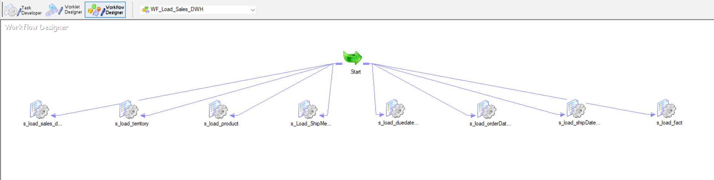
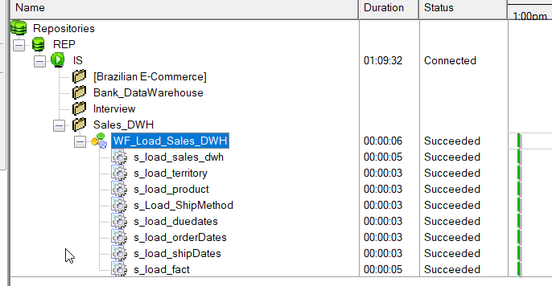

# Sales Data Warehouse (SQL Server + Informatica PowerCenter) — Star Schema

A Sales Data Warehouse project built on **Microsoft SQL Server** and loaded using **Informatica PowerCenter**.  
The warehouse follows a **Star Schema** model (Fact + Dimensions) to support fast analytics and reporting.

---

## 📌 Project Highlights

- ✅ Star Schema Data Model (FactSales + conformed Dimensions)
- ✅ ETL implemented with Informatica PowerCenter mappings & workflows
- ✅ Separate loads for each dimension + final Fact load
- ✅ SQL scripts for creating/loading the warehouse objects
- ✅ Visual documentation (diagrams, workflow screenshots, mapping screenshots)

---

## 🧱 Data Warehouse Model

The warehouse is designed as a **Star Schema**:

- **Fact Table**
  - `FactSales`

- **Dimensions**
  - `DimTerritory`
  - `DimShipMethods`
  - `DimProducts`
  - `DimOrderDates`
  - `DimDueDates`
  - `DimShipDates`

📷 Star Schema Diagram:  


---

## 🔁 ETL Flow (Informatica PowerCenter)

ETL loads are executed in the following order:

1. Load **Bronze Layer / Staging Sales**
2. Load Dimensions:
   - Territory
   - Ship Methods
   - Products
   - Order Dates
   - Due Dates
   - Ship Dates
3. Load **FactSales**

📷 Workflow Manager / Monitor:
- 
- 

📷 Mapping Screenshots:
- 
- 
- 
- 
- 
- 
- 
- 

---

## 📂 Repository Structure

```bash
.
├── Data Source/                # Source files / dataset (if any)
├── Informatica Mapping/        # Informatica exported objects (mappings, sessions, workflows)
├── Scripts/                    # SQL scripts (DDL/DML) to build & load the DWH
├── Visualization/              # Any dashboards / visuals / docs
├── *.png                       # Diagrams + screenshots (mappings, workflows)
└── Sales_DWH.bak               # SQL Server backup (restore to run locally)
